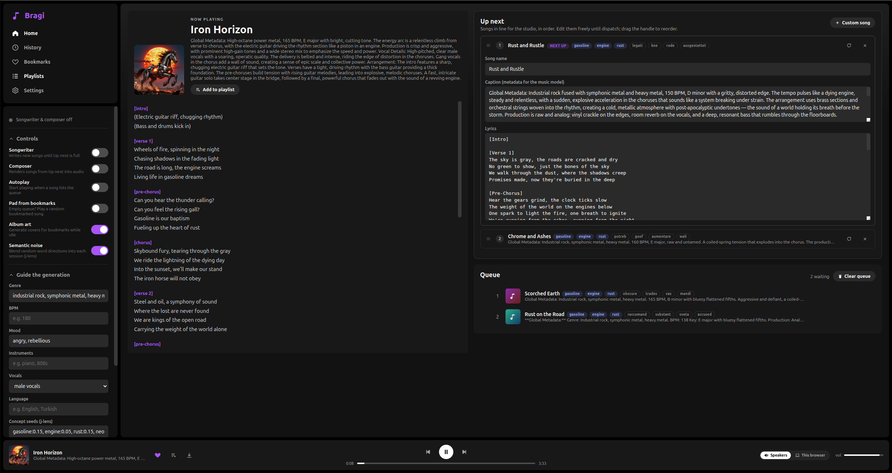
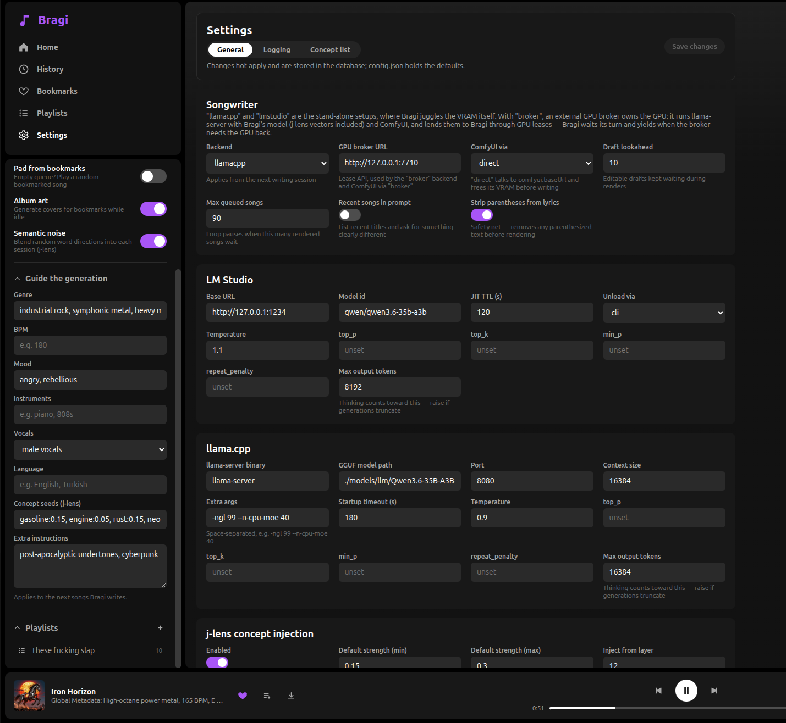

# Bragi




Endless, disposable music, generated locally. A local LLM writes the songs (title, style caption, lyrics), MiniMax Music 3 running in ComfyUI performs them, and the server plays the result through your speakers with mpv. The web dashboard works as a remote, or as the player itself if you'd rather listen in the browser.

Named after the Norse god of poetry and music.

## How it works

```
┌─> free ComfyUI's VRAM
│      │
│   songwriter LLM fills "Up next" with drafts
│      │
│   unload the LLM
│      │
│   ComfyUI renders the oldest draft      <── the other drafts stay editable
│      │
└── finished song joins the queue, saved as songs/<Song Name>.mp3
```

The LLM and the music model never sit in VRAM at the same time. Every draft is written before a render starts, so while ComfyUI works on one song you can still edit, reorder, rewrite or delete the rest. A draft is locked once it's handed to ComfyUI.

## Requirements

- Node.js 22.13+ (Bragi uses the built-in `node:sqlite`)
- `mpv` on the PATH, for playback through the server's speakers
- [ComfyUI](https://github.com/comfyanonymous/ComfyUI) on `http://127.0.0.1:8188` with the MiniMax Music 3 nodes and models installed (see `audio_minimax_music_3.json`). Album covers use a Z-Image Turbo workflow (`album_cover.json`); that part is optional.
- A songwriter LLM, one of:
  - `llama-server` from [llama.cpp](https://github.com/ggml-org/llama.cpp) plus a GGUF model (default; required for j-lens concept injection)
  - [LM Studio](https://lmstudio.ai) serving on `http://127.0.0.1:1234`, with the `lms` CLI on the PATH

The defaults are tuned for Qwen3.6-35B-A3B on a 16 GB card, but any capable instruction-following model should work.

## Setup

```bash
npm run setup    # server + web dependencies
npm run build    # build the frontend
npm start        # http://localhost:7700
```

For frontend work, `npm run dev` runs the server on :7700 and Vite with hot reload on :5173.

Open the dashboard, fill in some guidance if you like (genre, BPM, mood, ...), and turn on the **Songwriter** and **Composer** switches. Once the first song is in the queue, press play. From then on the queue advances by itself.

## Configuration

`config.json` holds the defaults. Changes made on the Settings page are stored in the database and applied on top of it, so the app never rewrites `config.json`. Set `BRAGI_CONFIG` to use a different file.

| Key | Meaning |
| --- | --- |
| `llm.backend` | `"llamacpp"` (default), `"lmstudio"` or `"broker"`. See [Songwriter backends](#songwriter-backends) |
| `llamacpp.*` | llama-server binary, GGUF path, port, context size, sampling, extra args, and the `jlens` block |
| `lmstudio.baseUrl` / `model` | LM Studio endpoint and model id |
| `lmstudio.unload` | `"cli"` (`lms unload --all`), `"ttl"` (rely on the per-request TTL) or `"none"` |
| `lmstudio.ttlSeconds` | JIT TTL sent with each request as a fallback auto-unload |
| `comfyui.via` | `"direct"` (default) or `"broker"`. See [Sharing the GPU](#sharing-the-gpu-with-other-apps) |
| `comfyui.baseUrl` / `workflow` | ComfyUI endpoint and workflow template (`${caption}` / `${lyrics}` placeholders) |
| `comfyui.freeWaitMs` | How long to wait after `POST /free` for the VRAM to actually come back |
| `comfyui.workflowOverrides` | Music generation parameters applied to the workflow at dispatch time |
| `covers.workflow` / `workflowOverrides` | Album cover workflow (`$prompt` placeholder) and its parameters |
| `generation.maxQueuedSongs` | The composer pauses when this many unplayed songs are queued |
| `generation.draftLookahead` | How many drafts stay editable while a render runs (default 3) |
| `generation.recentSongsInPrompt` | Show recent titles to the songwriter and ask for something different |
| `generation.stripParentheses` | Remove parenthesized text from lyrics before rendering |
| `gpuBroker.url` | GPU broker lease API, only used with the `"broker"` options |
| `storage.songsDir` | Where finished songs are saved |
| `server.port` | Dashboard/API port (or `PORT`) |
| `logging.*` | Debug log categories, and an optional log file |

The songwriter's system prompt is `server/prompts/system-prompt.md` and the cover art director's is `server/prompts/cover-prompt.md`. Both are read fresh each time, and the system prompt can also be edited from Settings.

If your LM Studio server needs an API key, copy `.env.example` to `.env` and set `LLM_API_KEY`. It's sent as a bearer token; a real environment variable takes precedence.

## Songwriter backends

- **`llamacpp`**: Bragi starts its own `llama-server` for each writing session and kills it afterwards, which is also how the VRAM gets handed to ComfyUI. Set `llamacpp.model` to your GGUF, `llamacpp.serverBin` to the binary (defaults to `llama-server` on the PATH), and `llamacpp.extraArgs` to your usual flags, e.g. `["-ngl", "99", "--n-cpu-moe", "40"]` to keep MoE experts in system RAM. Server output goes to `data/llama-server.log`.

  Building llama-server with CUDA:

  ```bash
  git clone https://github.com/ggml-org/llama.cpp && cd llama.cpp
  cmake -B build -DGGML_CUDA=ON -DCMAKE_CUDA_ARCHITECTURES=120 -DLLAMA_CURL=OFF
  cmake --build build --config Release --target llama-server -j
  ```

  Set `CMAKE_CUDA_ARCHITECTURES` for your card (120 is RTX 50-series). On Ubuntu you may also need `-DCMAKE_CUDA_COMPILER=/usr/local/cuda/bin/nvcc`, otherwise CMake can pick up an older apt `nvcc` that doesn't work with gcc 13.

- **`lmstudio`**: uses an LM Studio server and unloads the model between steps with `lms`. No concept injection, but pinned concept seeds are still passed in the prompt.

- **`broker`**: an external process runs llama-server and lends it out. See [Sharing the GPU](#sharing-the-gpu-with-other-apps).

## j-lens concept injection

With `llamacpp.jlens.enabled`, Bragi can steer the songwriter by adding control vectors to the model's residual stream. The vectors come from a fitted [Jacobian lens](https://github.com/anthropics/jacobian-lens): for a concept word *w* and the lens Jacobian `J_l` at layer *l*, the injected direction solves `J_l x ≈ u_w` (ridge-regularized). Roughly, it's the layer-*l* direction whose average downstream effect is "say *w*".

One-time setup:

```bash
uv venv tools/.venv && uv pip install --python tools/.venv/bin/python -r tools/requirements.txt
tools/.venv/bin/python tools/jlens_precompute.py \
    --lens /path/to/lens.pt --out data/jlens/deck.npz
```

`jlens_precompute.py` downloads only the tokenizer and the `lm_head` rows it needs from the Hugging Face repo (via range requests), then solves vectors for every word in `tools/jlens_wordlist.txt`. It also writes `deck-ainv.npy`, a per-layer solver cache of about 640 MB. If the lens file won't load, `--inspect` dumps its structure.

Words that aren't in the deck get solved on demand: pin one and the server runs `jlens_make_cv.py --auto-add`, which takes a few seconds and adds the word to the deck for good. To add words by hand: `jlens_precompute.py --lens ... --out data/jlens/deck.npz --add gasoline,asphalt`.

Injection is off unless you ask for it. Leave the **Concept seeds** field empty and songs are generated untouched. Enter concepts (`ocean, rust:0.2`, strengths optional) or the word `random` to draw `conceptsPerSession` words from the concept list. Bragi then builds `data/jlens/cv-<hash>.gguf` and passes it to llama-server with `--control-vector`. The active concepts show up as chips on drafts and in the engine status.

Tuning knobs live under `llamacpp.jlens`: `conceptsPerSession`, `strengthRange`, `layerRange` and `mentionInPrompt` (also name the concepts in the prompt).

**Calibration.** On Qwen3.6-35B-A3B, strength compounds across layers and the response is steep. On layers 12–20, 0.15–0.3 per concept colors the imagery while keeping the song coherent (the default). Around 0.5 the structure starts to fall apart, and near 1 the model just chants the word. If you inject across a wider band (say 8–30), stay around 0.05–0.12. When a draft comes out as word salad, the chips tell you what to turn down.

### Sparse semantic noise (experimental)

This one is an improvised idea that I'm still trying out. I don't know yet how much it actually helps, so treat it as a toy rather than a feature, and expect the defaults to change.

The problem it's poking at: a songwriter LLM left to itself keeps drifting back to the same handful of themes and images. Plain random noise in the activations doesn't fix that, because isotropic noise is nearly orthogonal to every feature and does nothing at safe norms. So instead, a sidebar toggle adds a second control vector to every song: a random blend of K common words from the full vocabulary, pulled back through the lens the same way as concepts. The hope is that each song gets a different, meaningful nudge, but whether that beats no noise at all is still an open question. It stacks with concept injection, since llama.cpp sums multiple control vectors.

The blend is re-rolled for every song. Control vectors are fixed when llama-server starts, so Bragi restarts the (already warm) server between drafts, which costs a few seconds. Blend size and strength are in Settings (`llamacpp.jlens.noise.tokens` / `.strength`). The first use downloads the full unembedding matrix once (`data/jlens/lm-head.npy`, about 1 GB).

## Playback

The **Speakers / This browser** switch in the player bar picks where music plays:

- **Speakers** (default): the server plays through mpv and runs the queue itself (auto-advance, autoplay, padding from bookmarks, play counts, history). Any number of dashboard tabs act as remotes. Extra mpv flags can be passed with `BRAGI_MPV_ARGS`.
- **This browser**: the tab plays the audio and reports finished songs back to the server.

Switching hands the current song over at the same position.

## Dashboard

- **Songwriter** and **Composer** run independently. The songwriter keeps writing until Up next holds `draftLookahead` drafts; the composer renders from Up next. With both on they take turns. The songwriter alone stockpiles drafts, the composer alone drains them.
- **Guidance**: genre, BPM, mood, instruments, vocals, language and free-form notes, applied to everything written next.
- **Up next**: drafts waiting to be rendered. Expand one to edit it, drag to reorder, **Rewrite** to ask for a different song, or add your own with **+ Custom song**. Drafts with an empty caption or lyrics are skipped.
- **In the studio**: the song being rendered, with a **Cancel** button.
- **Queue**: rendered songs waiting to play.
- **Re-render**: right-click a song for a new take of the same lyrics, or **Edit & re-render** to tweak it first (the draft is held until you press **Ready**).
- **Bookmarks** keep songs out of the disposable churn. **Playlists** live in the sidebar; drag songs onto them. Rows support multi-select, right-click menus and downloads.
- **Album art**: while the pipeline is idle, Bragi generates covers for bookmarked songs. The LLM describes a scene for the cover, ComfyUI renders it, and it lands in `data/covers/`. The cover engine yields as soon as the song pipeline has work again.

## Settings

The Settings page edits nearly everything live: backend and sampling, connection details, j-lens defaults, ComfyUI and music generation parameters, queue sizes, and the system prompt. Changes apply from the next writing session or render. `server.port` and `storage.songsDir` need a restart.

Music parameters are stored as `comfyui.workflowOverrides` and matched to workflow nodes by `class_type` at dispatch time, so the exported workflow JSON stays untouched. Blank fields fall back to the template's values.

The **Concept list** tab holds the word pool for `random` concepts. It's seeded from `tools/jlens_wordlist.txt` on first run and lives in the database after that.

The **Logging** tab toggles debug categories (`engine`, `prompts`, `llmResponses`, `comfy`, `jlens`, `llamacpp`, `covers`, `player`, `http`) and has a live log viewer.

## Storage

Everything stateful lives in `data/bragi.db` (SQLite): library, queue, history, drafts, guidance, toggles, playback settings and config overrides. Songs are saved to `songs/<Song Name>.mp3` and covers to `data/covers/`. Delete `data/bragi.db` to start over. `BRAGI_DATA` moves the data directory.

## Requesting songs over HTTP

Other programs (a chat assistant, a script, a home automation) can ask for songs. Requests skip the line and run even with both switches off.

- `POST /api/compose {name, caption, lyrics, play?}` puts ready-made lyrics at the front of Up next, to be rendered next.
- `POST /api/write {guidance?, prompt?, play?}` commissions a song: the songwriter writes it in the background (`guidance` replaces the global guidance for that song, `prompt` is passed to the songwriter as-is), then it's rendered like above. Pending commissions show in Up next and survive restarts. `DELETE /api/commissions/:id` cancels one.
- With `play: true`, the finished song goes to the front of the queue and starts right away if nothing is playing.

`GET /api/view` (and `GET /api/view/events` as SSE) returns a compact state for external clients: player, current song with absolute `coverPath`/`audioPath`, the next 10 queued songs, engine status, drafts and commissions.

## Sharing the GPU with other apps

By default Bragi assumes it has the GPU to itself and juggles VRAM on its own. If something else on the machine also needs the GPU, you can put a broker in charge instead: a separate process that owns llama-server and ComfyUI and lends them out. Set `llm.backend` and `comfyui.via` to `"broker"` and point `gpuBroker.url` at it.

Bragi then asks for a lease before each piece of GPU work:

```
POST {gpuBroker.url}/v1/gpu/leases
→ held-open NDJSON stream: queued* → granted → ping* → revoked | end
```

- **Writing**: `{workload: "llm", client: "bragi", profile: "bragi", control_vectors: [...], purpose, urgent}`. A new lease is requested whenever the control vectors change. The `granted` event carries `base_url`, the llama-server to talk to.
- **Rendering**: `{workload: "comfyui", ...}` around each song or cover render; `base_url` is the ComfyUI to use.
- **Revocation**: the broker can take the GPU back at any time. An interrupted draft is retried and an interrupted render goes back to the front of Up next. Neither counts as an error.
- **Urgent**: songs requested over the API ask for `urgent` leases.
- Releasing a lease means closing the connection.

## API reference

All endpoints are local and unauthenticated.

| | |
| --- | --- |
| State | `GET /api/state`, `GET /api/events` (SSE), `GET /api/view`, `GET /api/view/events` |
| Library | `GET /api/library?query=&limit=20`, `DELETE /api/songs/:id`, `POST /api/songs/:id/bookmark`, `POST /api/songs/bulk-bookmark`, `POST /api/songs/:id/played`, `POST /api/songs/:id/reroll {hold?}`, `POST /api/songs/:id/cover/regenerate`, `GET /audio/<file>` |
| Player | `POST /api/player/{play {songId?}, pause, toggle, next, previous, seek {positionS}, volume {volume}}`, `PATCH /api/player {output}` |
| Queue | `POST /api/queue/:id/remove`, `POST /api/queue/clear` |
| Drafts | `POST /api/drafts`, `POST /api/drafts/reorder`, `PATCH /api/drafts/:id`, `POST /api/drafts/:id/regenerate`, `DELETE /api/drafts/:id`, `POST /api/generating/cancel` |
| Requests | `POST /api/compose`, `POST /api/write`, `DELETE /api/commissions/:id` |
| Playlists | `POST\|PATCH\|DELETE /api/playlists[/:id]`, `POST /api/playlists/:id/songs {add, remove}`, `POST /api/playlists/reorder` |
| Engine | `POST /api/engine {songwriter?, composer?}`, `PATCH /api/settings`, `PATCH /api/guidance` |
| Config | `GET\|PATCH /api/config` (dotted paths, e.g. `{"llamacpp.temperature": 0.8}`), `GET\|PUT /api/system-prompt`, `GET\|PUT /api/concept-words`, `POST /api/concept-words/reset`, `GET /api/logs?since=<id>`, `POST /api/logs/clear` |
